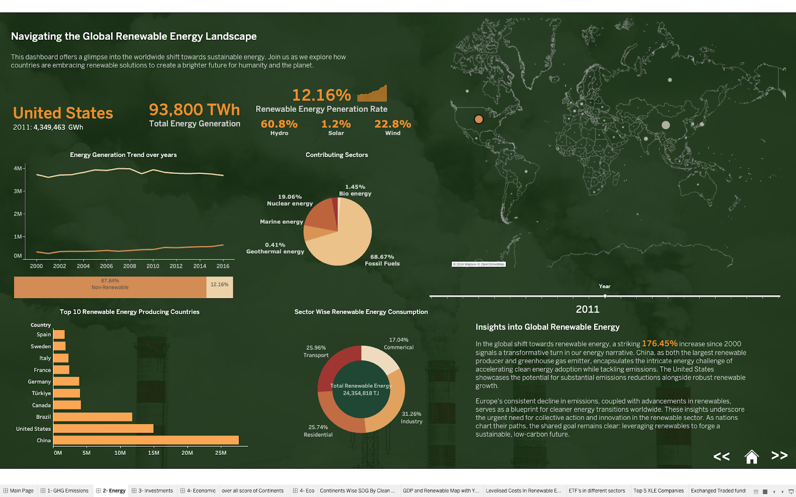
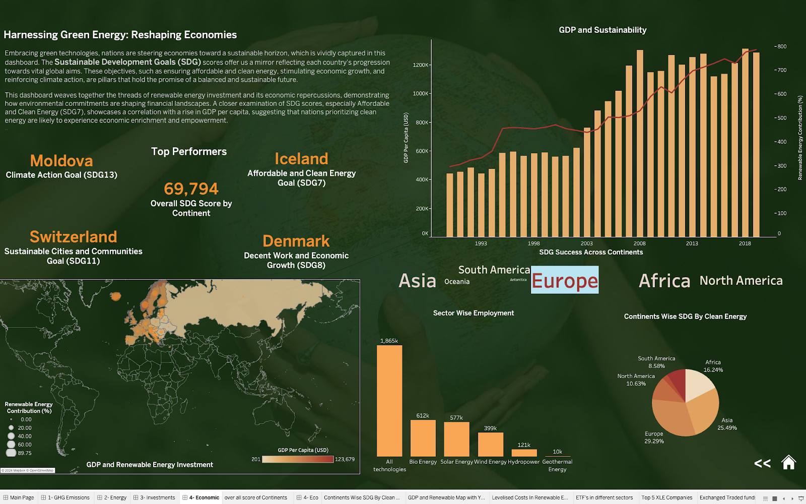

# Green Prosperity: Is Sustainable Energy the Key to National Growth?

## Project Overview

This project explores the critical intersection between sustainable energy adoption and national economic growth. Through comprehensive data analysis and dynamic visualization using Tableau, we examine key factors including global greenhouse gas emissions, renewable energy trends, clean energy investments, and their collective impact on economic performance. Our aim is to assess whether investments in renewable energy significantly contribute to national growth and sustainable development.

## Key Findings

- Global greenhouse gas emissions have surged by 107.4% from 1970 to 2022, with the power industry alone contributing 27.21% of total emissions.
- Renewable energy generation has shown remarkable growth, increasing by 176.45% from 2000 to 2021.
- Global investments in renewable energy have seen a substantial average annual increase of 169%.
- Countries prioritizing sustainable development demonstrate clear positive correlations between renewable energy adoption and economic growth.

## The Shift Towards Sustainable Energy: A Global Perspective

As the world grapples with the escalating challenges of climate change, nations are increasingly turning to renewable energy as a key driver of both environmental sustainability and economic transformation. Our analysis of the global energy landscape reveals profound shifts across multiple dimensions—from greenhouse gas (GHG) emissions to investments in clean energy—and their far-reaching impact on national economies.

## Dashboard Analysis

### 1. Global Greenhouse Gas Emissions

This dashboard spotlights the critical issue of greenhouse gas emissions, with a particular focus on the power industry's significant 27.21% contribution to global emissions. Despite ongoing efforts to curb emissions, the world has witnessed a staggering 107.4% increase in GHG emissions from 1970 to 2022. This analysis underscores the urgent need for countries to implement and rigorously enforce stricter emission reduction policies as the global race towards achieving net-zero by 2050 intensifies.

**Key Insights:**
- The power industry is responsible for 27.21% of global emissions.
- Global GHG emissions have increased by 107.4% from 1970 to 2022.
- There is an urgent need for more stringent emission reduction policies worldwide.

### 2. Renewable Energy Landscape

Our second dashboard explores the evolving global renewable energy landscape. The period from 2000 to 2021 saw a remarkable 176.45% increase in renewable energy generation. However, this growth presents a complex picture: countries like China, while leading in renewable energy production, remain top contributors to GHG emissions. This paradox highlights the ongoing dominance of non-renewable energy sources in many national energy mixes. Conversely, the United States serves as an example of how strategic investments in renewable energy can simultaneously reduce emissions and increase energy capacity, pointing towards a future where clean energy can effectively balance economic growth and environmental sustainability.

**Key Insights:**
- Renewable energy generation increased by 176.45% from 2000 to 2021.
- China leads in renewable energy production but remains a top GHG emitter.
- The United States demonstrates how renewable investments can reduce emissions while increasing energy capacity.

### 3. Investment in Renewable Energy

This dashboard reveals significant trends in global financial commitments to renewable energy, with particular growth in Asia-Pacific and the Americas. Emerging economies such as Brazil, India, and Mexico are becoming leading recipients of these investments, signaling a global shift towards financing clean energy projects. The investment surge, marked by an average annual increase of 169%, indicates the growing recognition of renewable energy as a cornerstone of future energy strategies and economic development.

**Key Insights:**
- Asia-Pacific and the Americas are seeing the highest growth in renewable energy investments.
- Emerging economies are becoming major recipients of clean energy investments.
- The 169% average annual increase in investments signals strong confidence in the renewable sector.

### 4. Economic Impact of Green Energy

Our final dashboard focuses on the economic implications of renewable energy adoption. Countries that prioritize sustainable development, such as Iceland, Switzerland, and Denmark, exhibit clear correlations between renewable energy adoption and robust economic growth. This suggests that clean energy is not just an environmental imperative but a key contributor to national economic prosperity. Nations investing in affordable and clean energy, alongside efforts in climate action and sustainable urban development, are better positioned to achieve sustained economic growth and improved quality of life for their citizens.

**Key Insights:**
- Countries prioritizing sustainable development show stronger economic performance.
- There's a clear positive correlation between renewable energy adoption and economic growth.
- Investments in clean energy contribute to both environmental sustainability and economic prosperity.

## Conclusion

The findings across these dashboards point to a global paradigm shift towards renewable energy, driven by the dual imperatives of mitigating climate change and fostering economic growth. As investments continue to rise and nations adopt increasingly stringent climate policies, renewable energy is poised to fundamentally reshape the global economy. However, the journey to a sustainable future requires a balanced approach that integrates environmental goals with economic development, ensuring that no nation is left behind in the pursuit of green prosperity.

The data clearly shows that countries embracing renewable energy and sustainable practices are not only contributing to global climate goals but are also positioning themselves for stronger, more resilient economic growth. This symbiotic relationship between sustainability and prosperity offers a compelling roadmap for nations worldwide as they navigate the challenges of the 21st century.

## Future Work

To build upon this research and further illuminate the path to green prosperity, we propose the following areas for future investigation:

- Conduct in-depth analysis of specific renewable energy policies and their direct impact on economic growth metrics.
- Explore the role of technological advancements in driving down renewable energy costs and accelerating adoption.
- Develop comprehensive case studies of countries successfully transitioning to renewable energy, highlighting best practices and lessons learned.
- Investigate the potential of emerging technologies like green hydrogen and advanced energy storage in reshaping the renewable energy landscape.

## How to Use This Repository

1. **Data**: Raw data files are located in the `data` directory.
2. **Tableau Workbooks**: Tableau files used for visualization are stored in the `tableau` directory.
3. **Scripts**: Any data processing scripts can be found in the `scripts` folder.
4. **Documentation**: Additional documentation and methodologies are available in the `docs` directory.

## Data Sources

1. **EDGAR - Global Greenhouse Gas Emissions Data (1970-2022)**  
   Source: [EDGAR Report 2023](https://edgar.jrc.ec.europa.eu/report_2023#data_download)

2. **IRENA - Renewable Energy Capacity and Generation Data**  
   Source: [IRENA Data](https://www.irena.org/Data/View-data-by-topic/Capacity-and-Generation/Regional-Trends)

3. **Bloomberg New Energy Finance - Investment Trends in Renewable Energy**  
   Source: [BNEF Data](https://public.tableau.com/app/profile/bloomberg.new.energy.finance/viz/FDItoolPUBLICv_5/FDIemergingcountries)

4. **Sustainable Development Report 2023**  
   Source: [SDR 2023](https://www.kaggle.com/datasets/sazidthe1/sustainable-development-report)
