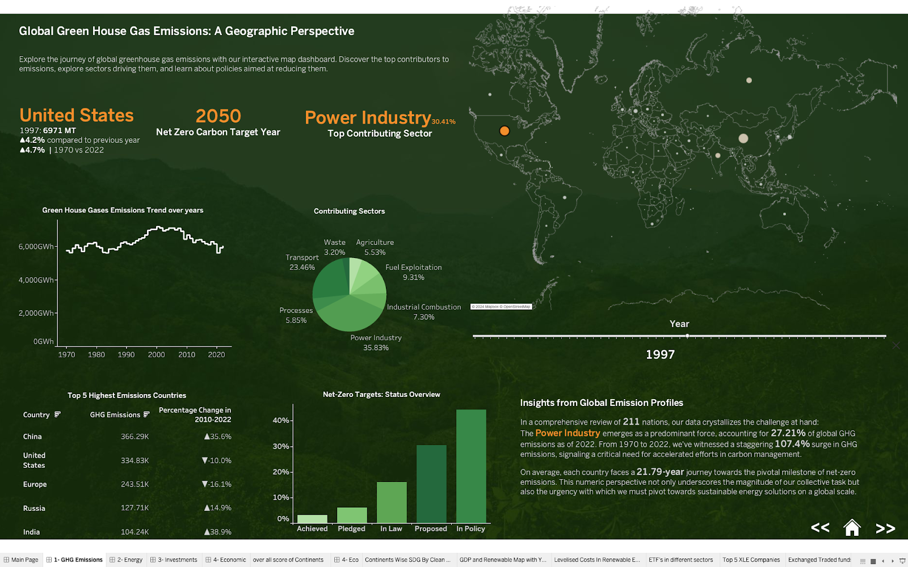
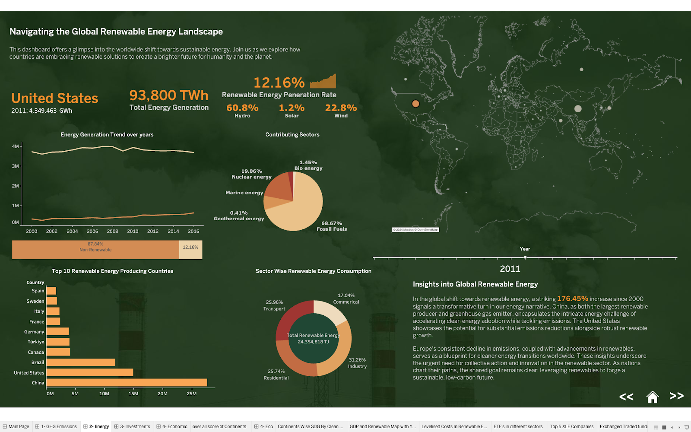
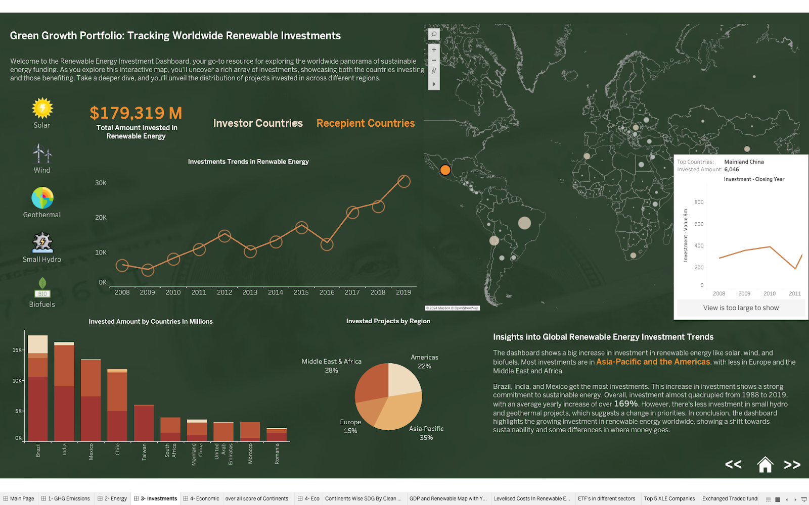
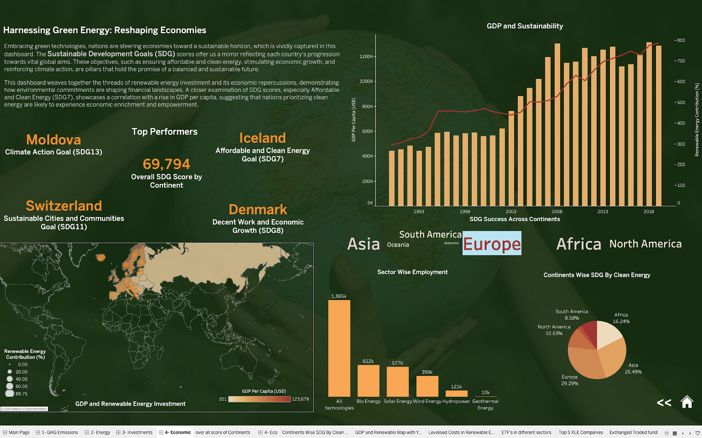

# Green Prosperity: Is Sustainable Energy the Key to National Growth?

## Project Overview

This project explores the intersection between sustainable energy adoption and national economic growth. Through data analysis and visualization using Tableau, we examine key factors such as global greenhouse gas emissions, renewable energy trends, investments in clean energy, and their impact on economic performance. The aim is to assess whether investments in renewable energy contribute to national growth and sustainable development.

## Key Findings

- Global greenhouse gas emissions have increased by 107.4% from 1970 to 2022, with the power industry contributing 27.21% of emissions.
- Renewable energy generation increased by 176.45% from 2000 to 2021.
- Global investments in renewable energy saw an average annual increase of 169%.
- Countries prioritizing sustainable development show clear correlations between renewable energy adoption and economic growth.

## Green Prosperity and the Shift Towards Sustainable Energy
As the world grapples with the escalating challenge of climate change, nations are increasingly turning to renewable energy as a key driver of both environmental and economic transformation. Our analysis of the global energy landscape sheds light on the profound shifts taking place across multiple dimensions—from greenhouse gas (GHG) emissions to investments in clean energy, and ultimately, their impact on national economies.

## Dashboards

### Dashboard 1: Global Greenhouse Gas Emissions
  
   The first dashboard highlights the critical issue of greenhouse gas emissions, particularly from the power industry, which contributes 27.21% of global emissions. Despite efforts to curb emissions, the world has seen a 107.4% increase in GHG emissions from 1970 to 2022. The analysis underscores the urgent need for countries to implement and enforce stricter emission reduction policies, as the global race towards achieving net-zero by 2050 intensifies.

**Key Insights:**
- The power industry contributes 27.21% of global emissions.
- Global GHG emissions increased by 107.4% from 1970 to 2022.
- Urgent need for stricter emission reduction policies worldwide.

### Dashboard 2: Renewable Energy Landscape
  
   The second dashboard explores the global renewable energy landscape. From 2000 to 2021, renewable energy generation increased by a staggering 176.45%. However, countries like China, which lead in renewable energy production, also remain top contributors to GHG emissions, indicating the complex energy mix still dominated by non-renewables. The United States stands as an example of how investments in renewable energy can simultaneously reduce emissions while increasing energy capacity, pointing to a future where clean energy can balance economic growth and environmental sustainability.

**Key Insights:**
- Renewable energy generation increased by 176.45% from 2000 to 2021.
- China leads in renewable energy production but remains a top GHG emitter.
- The United States demonstrates how renewable investments can reduce emissions while increasing energy capacity.

### Dashboard 3: Investment in Renewable Energy
  
   Investment trends are explored in the third dashboard, which shows a marked increase in global financial commitments to renewable energy, particularly in Asia-Pacific and the Americas. Brazil, India, and Mexico emerge as leading recipients of investments, highlighting the global shift towards financing clean energy projects. The investment surge, which saw an average annual increase of 169%, signals the growing recognition of renewable energy as a cornerstone of future energy strategies.

### Dashboard 4: Economic Impact of Green Energy
  
   The final dashboard focuses on the economic implications of renewable energy. Countries that prioritize sustainable development, such as Iceland, Switzerland, and Denmark, show clear correlations between renewable energy adoption and economic growth. This suggests that clean energy is not just an environmental solution but a key contributor to national economic prosperity. Nations investing in affordable and clean energy, alongside efforts in climate action and sustainable cities, are better positioned to achieve sustained economic growth.

## Conclusion:
The findings across these dashboards point to a global paradigm shift towards renewable energy, driven by the dual goals of mitigating climate change and fostering economic growth. As investments continue to rise and nations adopt stricter climate policies, renewable energy is poised to reshape the global economy. However, the journey to a sustainable future requires a balanced approach that integrates environmental goals with economic development, ensuring that no nation is left behind in the pursuit of green prosperity.

## Future Work

- Investigate the impact of specific renewable energy policies on economic growth.
- Analyze the role of technological advancements in driving down renewable energy costs.
- Explore case studies of countries successfully transitioning to renewable energy.

## How to Use This Repository

1. **Data**: Raw data files can be found in the `data` directory.
2. **Tableau Workbooks**: Tableau files used for visualization are in the `tableau` directory.
3. **Scripts**: Any data processing scripts are located in the `scripts` folder.

## Data Sources

1. **EDGAR - Global Greenhouse Gas Emissions Data (1970-2022)**  
   Source: [EDGAR Report 2023](https://edgar.jrc.ec.europa.eu/report_2023#data_download)

2. **IRENA - Renewable Energy Capacity and Generation Data**  
   Source: [IRENA Data](https://www.irena.org/Data/View-data-by-topic/Capacity-and-Generation/Regional-Trends)

3. **Bloomberg New Energy Finance - Investment Trends in Renewable Energy**  
   Source: [BNEF Data](https://public.tableau.com/app/profile/bloomberg.new.energy.finance/viz/FDItoolPUBLICv_5/FDIemergingcountries)

4. **Sustainable Development Report 2023**  
   Source: [SDR 2023](https://www.kaggle.com/datasets/sazidthe1/sustainable-development-report)

## Contributing

We welcome contributions to this project! Please see our [CONTRIBUTING.md](CONTRIBUTING.md) file for guidelines on how to submit issues, feature requests, and pull requests.

## License

This project is licensed under the MIT License - see the [LICENSE.md](LICENSE.md) file for details.
